# İpekçioğlu İnşaat Website

This project is a corporate website developed for the construction company İpekçioğlu İnşaat. Built with the ASP.NET MVC architecture, it allows users to explore the company's projects and contact the firm, while also providing an admin panel for content management.

---

## 🔧 Features

- Homepage highlighting featured projects and company info  
- About Us and Contact pages  
- Detailed project pages  
- Admin panel functionalities:  
  - Add / update / view project details  
  - View and manage incoming contact messages  
- Mobile-friendly and user-friendly design  
- SEO-optimized HTML structure

---

## 🖼️ Screenshots

### 🏠 User Interface

**Homepage**  
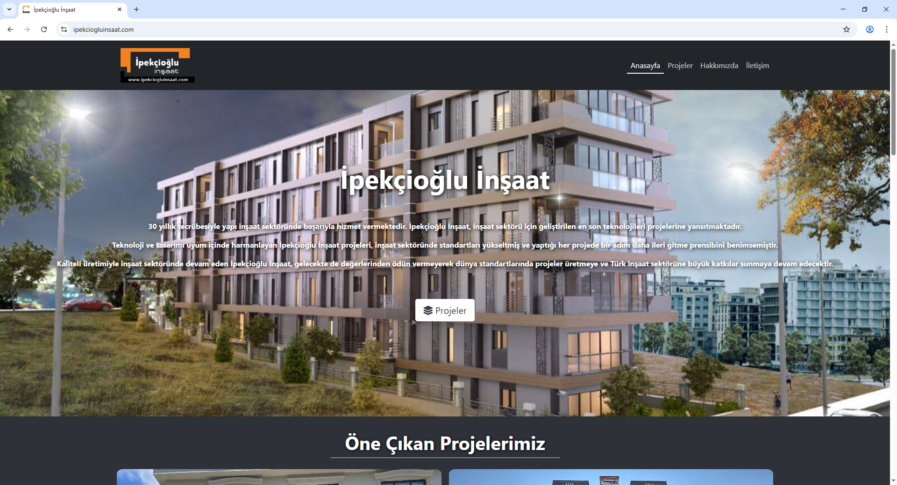  
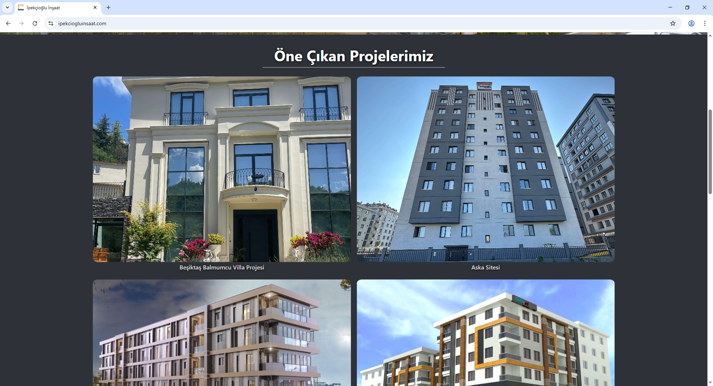  
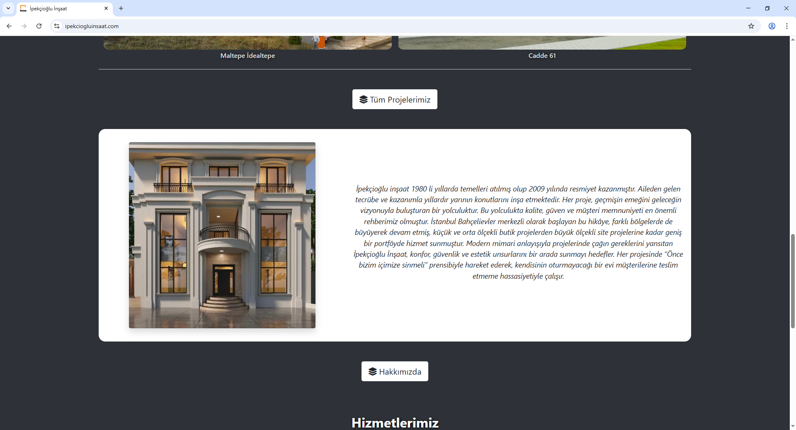  
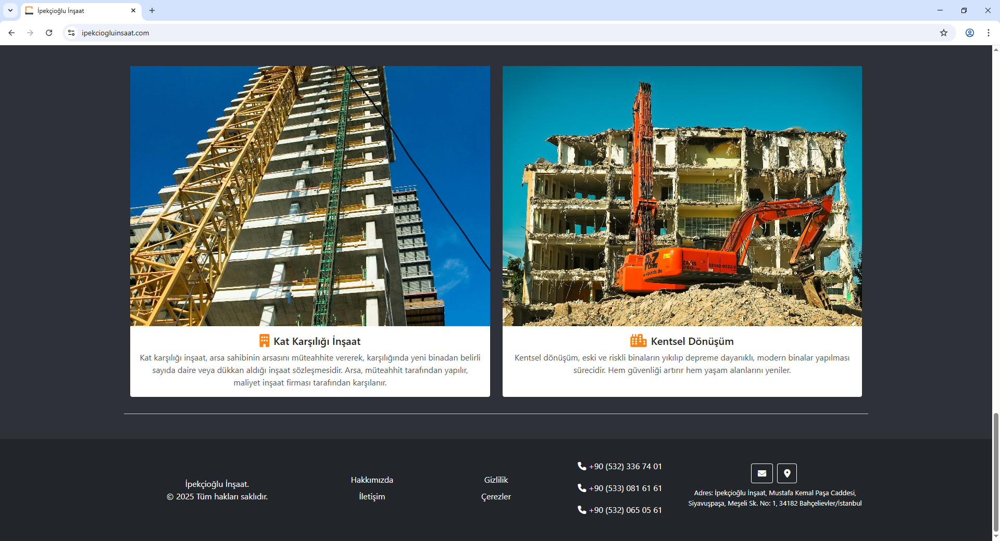

**About Us**  
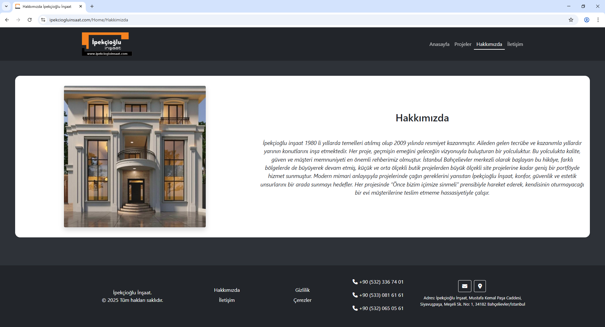

**Contact**  
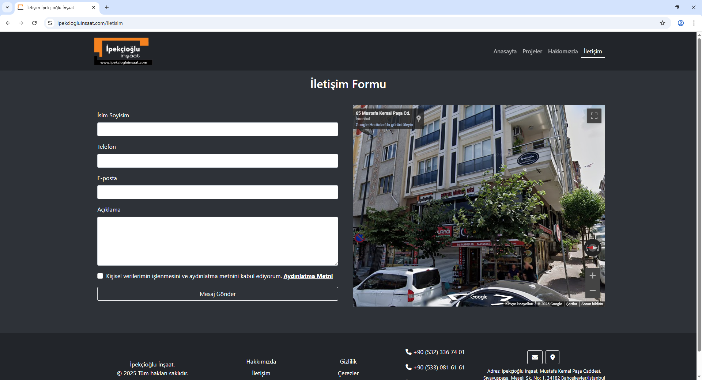

**Projects**  
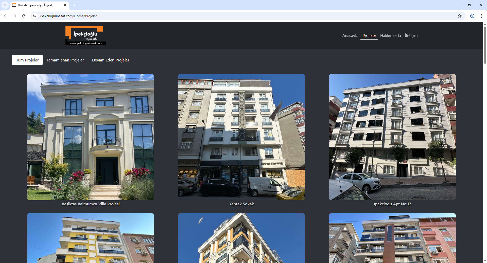

**Project Details (User)**  
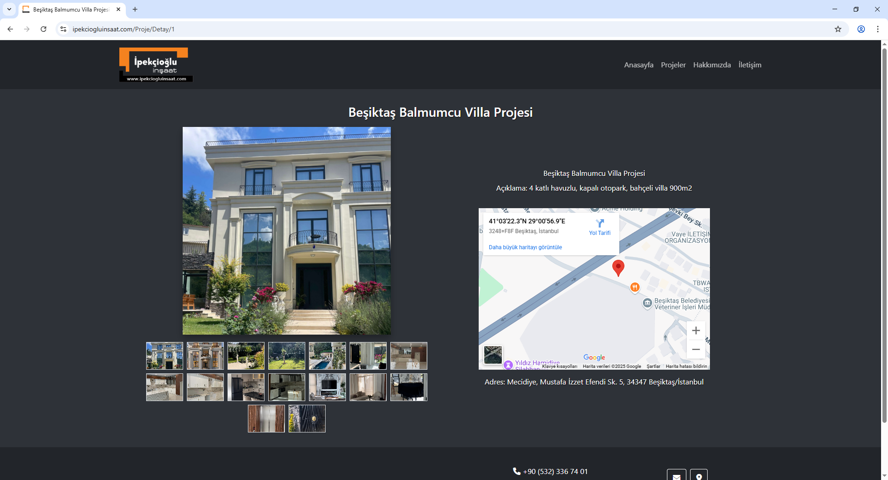  
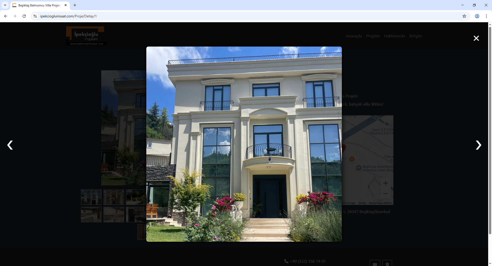

---

### 🔐 Admin Panel

**Admin Login Page**  
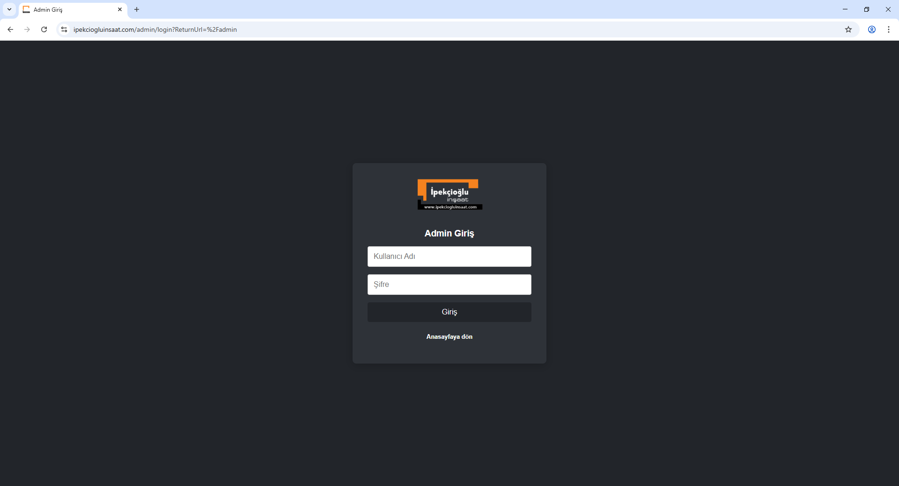

**Admin Dashboard**  
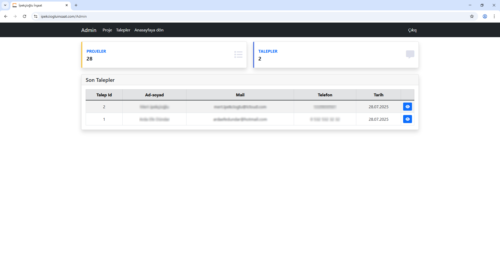

**Manage Projects (List View)**  
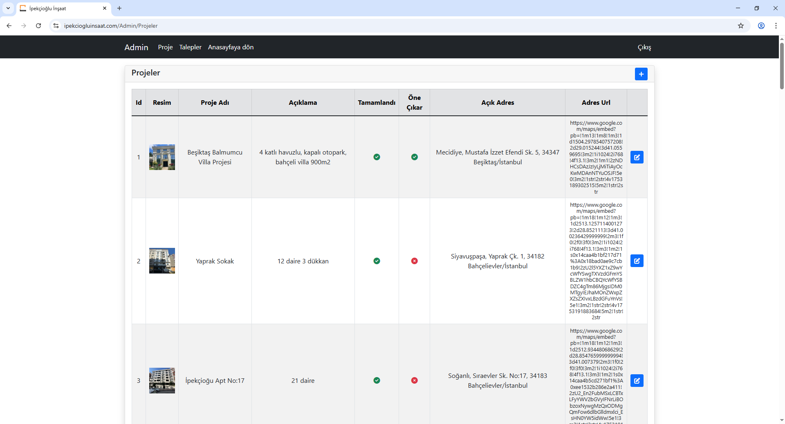

**Project Details (Admin)**  
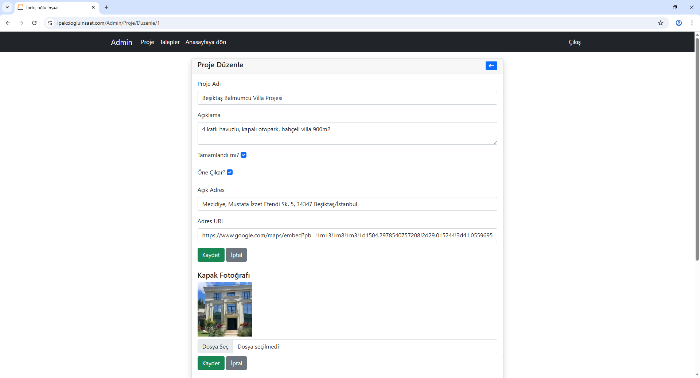  
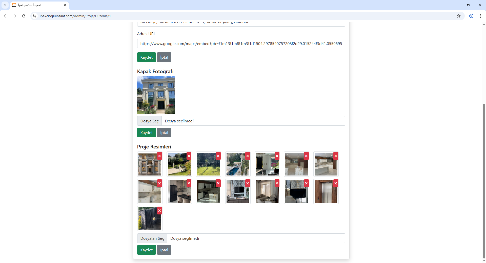

**Add New Project Page**  
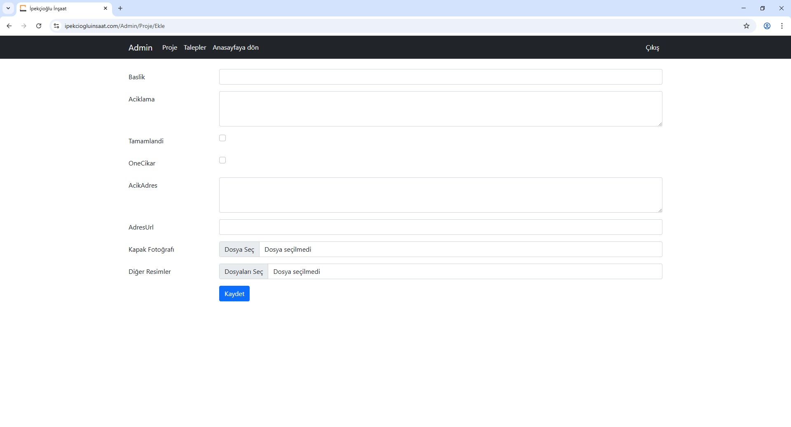

**Contact Messages**  
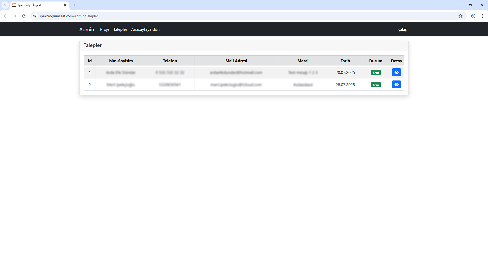

**Message Details**  
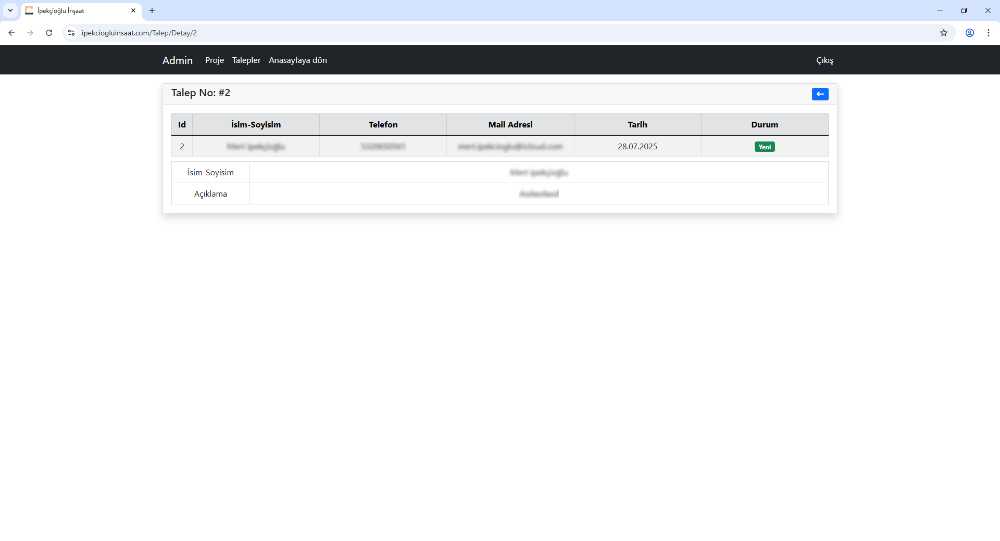

---

## 🧰 Technologies Used

- ASP.NET MVC (C#)  
- Entity Framework Core  
- SQL Server  
- HTML / CSS  
- Bootstrap

---

## ✍️ Developer

**Arda Efe Dündar**  
📧 Email: ardaefedundar@hotmail.com  
🌐 GitHub: https://github.com/ardaefe111
